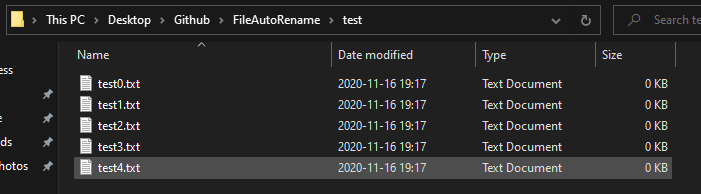
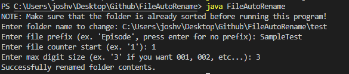
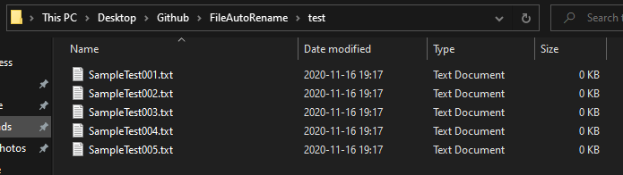

# File Auto Rename
This program allows you to automatically rename contents in a folder based on a counter.

## Sample Output
Starting contents:  

Command line:  

Resulting contents:  

## Required input 

### Folder path
The program will first ask you the path of the folder you wish to change. Simply enter the folder path.  
Ex.  
C:\Users\Folder1\Folder2\TargetFolder  

### File prefix
Enter the prefix of the file you want to rename  
Ex.  
Folder content:  
sample.txt  

Prefix selected: TestSample  
Resulting folder content:  
TestSample.txt  

### File Counter Start
This will dictate where the file auto counter will start. If your files start from an indicated number, you can enter this to continue to rename the content of the folder.  
Ex.  
Folder contents:  
sample3.txt  
sample4.txt  
sample5.txt  

File Counter Start selected: 6  
Resulting folder contents:  
sample6.txt  
sample7.txt  
sample8.txt  

### Max digit size
This will dicate the number of digits that is used for the File Counter.  
Ex.  
Folder contents:  
sample3.txt  
sample4.txt  
sample5.txt  

Max digit size selected: 3  
Resulting folder contents:  
sample003.txt  
sample004.txt  
sample005.txt  
